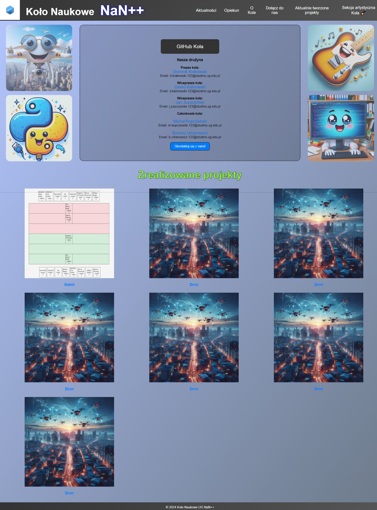
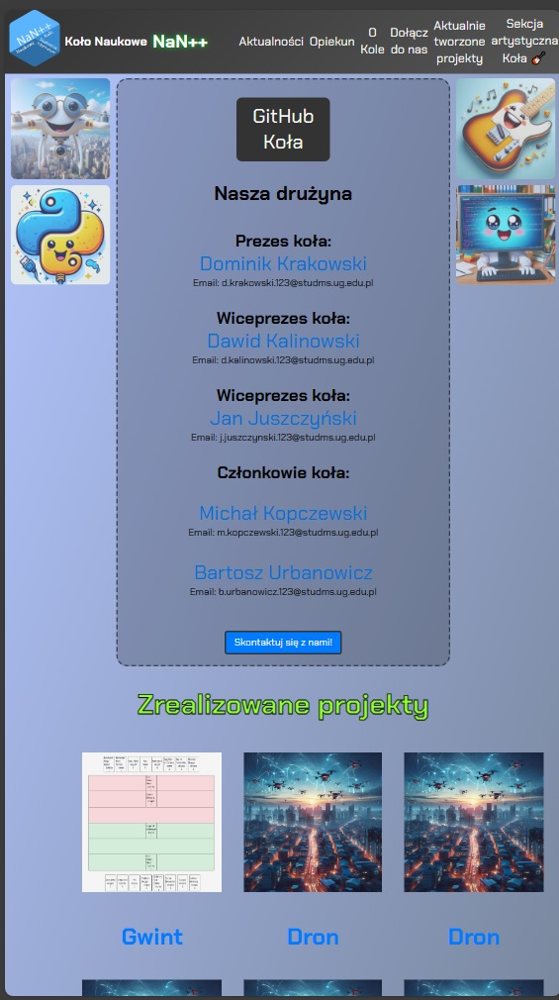

### Wersja Alpha 1.0

Założenia:
Wszystkie przyciski na stronie, na które można kliknąć, w niedalekiej przyszłości **BĘDĄ COŚ ROBIŁY** 😊

Aktualnie:
- Przycisk GitHub przenosi do [GitHuba koła](https://github.com/UGNaNpp) (na ten moment niewiele tam jest, ale spokojnie 😅)
- Przycisk Opiekun przenosi do [strony Piotra](https://inf.ug.edu.pl/~piotao/) 😀

Brakujące elementy:
- Po kliknięciu w nazwisko poszczególnego członka, przeniesiemy się na podstronę tej osoby. Tam każda osoba ma już wolną rękę, ale myślę, że doskonale będzie zamieścić po prostu portfolio. Jakie technologie zna dana osoba, oraz przede wszystkim w jakich projektach w ramach koła brała udział i czym dokładnie się w nich zajmowała
- Przycisk "skontaktuj się z nami" może zawierać formularz, który wysyła maila na mail koła (będzie trzeba założyć), lub na mail szefa. Może też będzie tam link do discorda koła?
- Aktualności: Wszystkie wydarzenia, które będzie organizować, oraz w których bierzemy, braliśmy, lub będziemy brali udział. Plany na przyszłość, itd.
- O Kole: Historia, założenia, czym się zajmujemy
- Dołącz do nas: Formularz dołączenia do koła
- Aktualnie tworzone projekty: lista projektów nad którymi pracujemy aktualnie, z linkami do repozytoriów. Nie wszystkie projekty, nad którymi pracujemy będą publikowane w zakładce, żeby ktoś nie ukradł pomysłu 
- Sekcja artystyczna koła: Tam będą zamieszczane wszelakie inicjatywy muzyczne jakie uda nam się zorganizować. Może muzyka polecana przez nas. Może sprzęt muzyczny polecany przez nas.
- Zrealizowane projekty: po kliknięciu w dany projekt, wyświetli się strona z opisaniem projektu, kto nad nim pracował, co robił, oraz repo do niego

#### Jak wygląda strona na komputerze:

#### Jak wygląda strona na telefonie:

